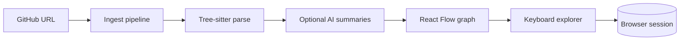

# CodeMap

[](https://codemap-mocw.vercel.app)

**One line:** AI-powered code deconstructor — ingest a public GitHub repo, explore files with keyboard navigation (hf-viewer style), and inspect an interactive dependency graph.

**Live demo:** [codemap-mocw.vercel.app](https://codemap-mocw.vercel.app) · Repo: [github.com/Dmallick01/codemap](https://github.com/Dmallick01/codemap)

## What it does



| Stage | Description |
|-------|-------------|
| **Ingest** | Fetch repo archive, hash files, skip unchanged on re-run |
| **Parse** | Extract modules, functions, imports (WASM tree-sitter) |
| **Analyze** | Optional summaries via Anthropic, OpenAI, or Ollama |
| **Explore** | `N` / `P` walk files; progress saved in `localStorage` |

Inspired by public dataset viewers like [hf-viewer](https://github.com/SJCaldwell/hf-viewer) — sequential sample browsing with auto-save and resume, applied to **code files** instead of Hugging Face rows.

## Quick start

```bash
git clone https://github.com/Dmallick01/codemap.git
cd codemap
npm install
cp .env.example .env.local
# Set DATABASE_URL (SQLite or Neon Postgres)

npx prisma migrate dev
npm run dev
```

Open http://localhost:3000 → paste `https://github.com/vercel/next.js` → **Analyze**.

## Explorer shortcuts

| Key | Action |
|-----|--------|
| `N` / `→` | Next file |
| `P` / `←` | Previous file |
| `R` | Random file |
| `?` | Toggle shortcut help |
| `Esc` | Close detail panel |

Session state is stored per repo in the browser (`codemap-explorer-<repoId>`).

## Environment variables

| Variable | Required | Description |
|----------|----------|-------------|
| `DATABASE_URL` | Yes | PostgreSQL (Neon) or compatible |
| `GITHUB_TOKEN` | No | Higher GitHub API rate limits |
| `AI_PROVIDER` | No | `anthropic`, `openai`, or `ollama` |
| `AI_MODEL` | No | Model id for chosen provider |
| `ANTHROPIC_API_KEY` | No | If using Anthropic |
| `OPENAI_API_KEY` | No | If using OpenAI |
| `MAX_FILES` | No | Cap files per ingest (default `500`) |

## Deploy (Vercel + Neon)

Production: **https://codemap-mocw.vercel.app** (set this as the repo homepage / Vercel production domain).

1. Create a [Neon](https://neon.tech) database → copy `DATABASE_URL`
2. Import this repo on [Vercel](https://vercel.com/new)
3. Add env vars from the table above
4. Deploy — build runs `prisma generate`, WASM copy, and `next build`
5. Run `npx prisma migrate deploy` against production DB once

## Local GPU (Ollama)

```bash
ollama pull llama3.2
```

```env
AI_PROVIDER=ollama
AI_MODEL=llama3.2
```

Ollama uses Metal on Apple Silicon automatically.

## Project structure

```
codemap/
├── app/                 # Next.js App Router
├── components/          # Graph nodes, explorer toolbar
├── hooks/               # useGraphExplorer
├── lib/pipeline/        # fetch → parse → analyze → graph
├── lib/explorer/        # localStorage session
├── prisma/              # schema + migrations
└── docs/ARCHITECTURE.md
```

## Tech stack

Next.js 16 · React Flow · Tree-sitter WASM · Prisma · LiteLLM · Octokit

## License

MIT
