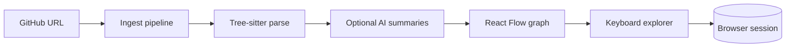

# CodeMap

[](https://codemap-mocw.vercel.app)

**One line:** Understand any public GitHub repo in seconds — **CodeMap Lite** maps structure and meaning without downloading the whole project. Optional **deep** mode adds full parse + AI.

**Live demo:** [codemap-mocw.vercel.app](https://codemap-mocw.vercel.app) · Repo: [github.com/Dmallick01/codemap](https://github.com/Dmallick01/codemap)

## What it does



| Stage | Description |
|-------|-------------|
| **Ingest** | Fetch repo archive, hash files, skip unchanged on re-run |
| **Parse** | Extract modules, functions, imports (WASM tree-sitter) |
| **Analyze** | Optional summaries via Anthropic, OpenAI, or Ollama |
| **Explore** | `N` / `P` walk files; progress saved in `localStorage` |
| **Architecture map** | Files grouped by role (entry, API, UI, pipeline…) on a 2D layout with colored dependency edges |

Inspired by public dataset viewers like [hf-viewer](https://github.com/SJCaldwell/hf-viewer) — sequential sample browsing with auto-save and resume, applied to **code files** instead of Hugging Face rows.

## Quick start

```bash
git clone https://github.com/Dmallick01/codemap.git
cd codemap
npm install
cp .env.example .env.local
# Set DATABASE_URL (SQLite or Neon Postgres)

npx prisma migrate dev
npm run dev
```

Open http://localhost:3000 → paste `https://github.com/vercel/next.js` → **Map repo** (Lite, default).

Deep mode: `POST /api/ingest` with `{ "url": "...", "mode": "deep" }`.

## Explorer shortcuts

| Key | Action |
|-----|--------|
| `N` / `→` | Next file |
| `P` / `←` | Previous file |
| `R` | Random file |
| `?` / `H` | Toggle panels & shortcut help |
| `L` | GitHub Lab (25 instruments) |
| `Esc` | Close panels / sheets |

**UI Studio** (`/analyze/[repoId]/ui`): `G` build element prompt · `E` export UI + DESIGN.md · `S` security brief · `L` Lab.

**Repo prompt generator** (`G`): three export modes —
- **Build UI element** — “Ask me how to build elements like: …” (components, layouts)
- **Build system / capability** — framework, agent loop, LLM layer, data plane, jobs (same shape as the repo)
- **Explain this GitHub** — wiki-style article: what it does, architecture, strengths, **what to improve**, porting guide (overview / deep-dive / onboarding)

Session state is stored per repo in the browser (`codemap-explorer-<repoId>`).

## End-to-end workflows

### UI Studio → DESIGN.md → agents

1. Map a GitHub repo → open **UI Studio** from the header.
2. Click **Export UI & DESIGN.md** (or press `E`).
3. CodeMap loads saved DESIGN.md from the database, or **extracts** tokens from `globals.css` / Tailwind config via GitHub.
4. **Lint** runs automatically after extract; fix issues in the editor.
5. **Save to map** persists DESIGN.md on the `Repo` record; **Save + commit GitHub** writes `DESIGN.md` at the repo root (needs `GITHUB_TOKEN` with contents write).
6. Copy or download **UI prompt**, **DESIGN.md**, or **combined** bundle for Cursor / Claude / v0.

### Architecture map → Security brief

1. On `/analyze/[repoId]`, use **Security** in the top HUD (always visible).
2. Optional: **Pull all security tools** — Dependabot, secret/auth path heuristics, Actions hygiene, CodeQL (needs `GITHUB_TOKEN` + `security_events` where applicable).
3. Run individual probes in **GitHub Lab** (`L`); security results cache into the brief via **Open security brief**.
4. Copy or download an OWASP-aligned implementation spec for your agent.

Imported `.codemap.json` maps without a GitHub `url` show a banner: Lab, extract, and live security pulls are disabled until you re-map from a URL.

## Environment variables

| Variable | Required | Description |
|----------|----------|-------------|
| `DATABASE_URL` | Yes | PostgreSQL (Neon) or compatible |
| `GITHUB_TOKEN` | No | Higher GitHub API rate limits |
| `AI_PROVIDER` | No | `anthropic`, `openai`, or `ollama` |
| `AI_MODEL` | No | Model id for chosen provider |
| `ANTHROPIC_API_KEY` | No | If using Anthropic |
| `OPENAI_API_KEY` | No | If using OpenAI |
| `MAX_FILES` | No | Cap files per ingest (default `500`) |

## Deploy (Vercel + Neon)

Production: **https://codemap-mocw.vercel.app** (set this as the repo homepage / Vercel production domain).

1. Create a [Neon](https://neon.tech) database → copy `DATABASE_URL`
2. Import this repo on [Vercel](https://vercel.com/new)
3. Add env vars from the table above
4. Deploy — build runs `prisma generate`, WASM copy, and `next build`
5. Run `npx prisma migrate deploy` against production DB once

## Local GPU (Ollama)

```bash
ollama pull llama3.2
```

```env
AI_PROVIDER=ollama
AI_MODEL=llama3.2
```

Ollama uses Metal on Apple Silicon automatically.

## Project structure

```
codemap/
├── app/                 # Next.js App Router
├── components/          # Graph nodes, explorer toolbar
├── hooks/               # useGraphExplorer
├── lib/pipeline/        # fetch → parse → analyze → graph
├── lib/explorer/        # localStorage session
├── prisma/              # schema + migrations
└── docs/ARCHITECTURE.md
```

## Tech stack

Next.js 16 · React Flow · Tree-sitter WASM · Prisma · LiteLLM · Octokit

## License

MIT
