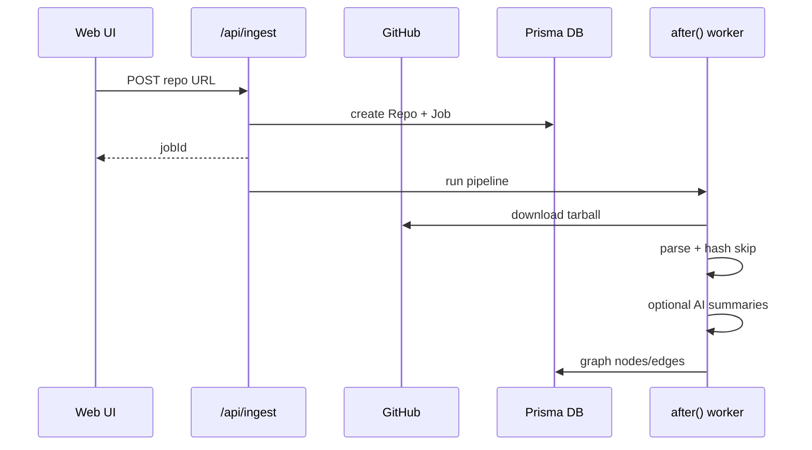

# CodeMap architecture

## Ingest pipeline

Steps: `fetching` → `parsing` → `analyzing` → `building` → `done`.

## Explorer mode (hf-viewer pattern)

Public tools like [SJCaldwell/hf-viewer](https://github.com/SJCaldwell/hf-viewer) stream dataset rows with:

- Next / previous navigation
- Auto-save after each action
- Resume on reload

CodeMap maps that to **files in a repo**:

1. Graph nodes sorted by `path`
2. `useGraphExplorer` tracks index + `viewedIds`
3. `localStorage` key `codemap-explorer-<repoId>`
4. Bottom toolbar + keyboard bindings on `/analyze/[repoId]`

## Graph layer

- **Layout:** Dagre top-bottom
- **UI:** `@xyflow/react` with custom `FileNode`
- **Detail:** `NodeDetail` sidebar for modules, functions, code snippets

## AI providers

`lib/services/ai.ts` routes to Anthropic, OpenAI, or Ollama via env. Content-hash caching skips unchanged file summaries on re-ingest.
